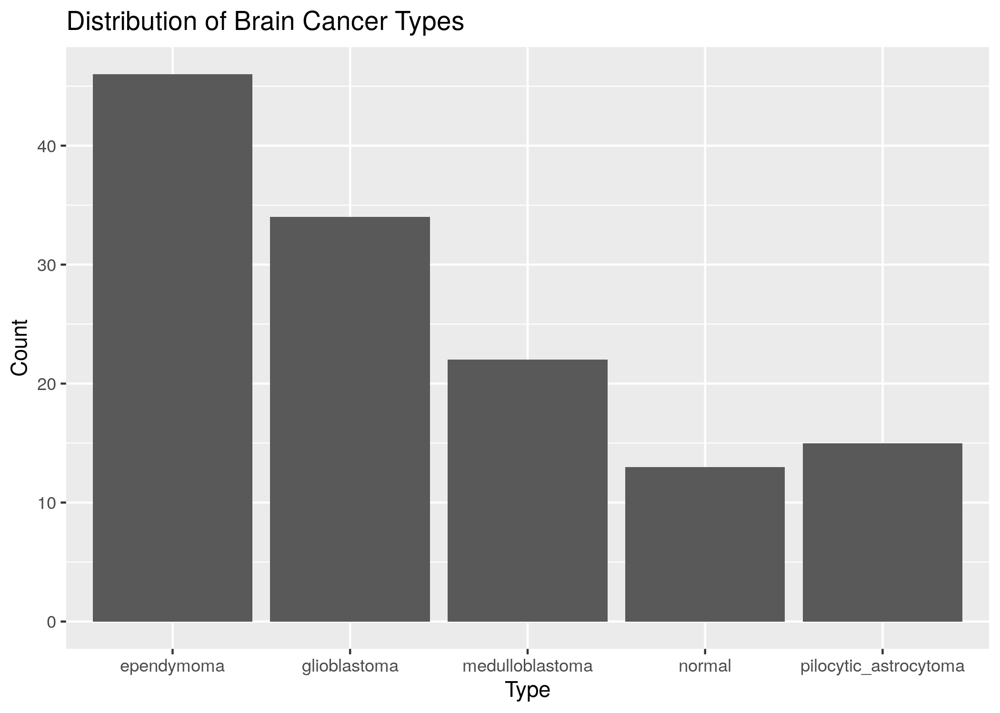

```{r setup, include=FALSE}
knitr::opts_chunk$set(echo = TRUE)
```

For this project, I am interested in analyzing and developing a predictive model for a [brain cancer gene expression dataset](https://sbcb.inf.ufrgs.br/cumida) from the Structural Bioinformatics and Computational Biology (SBCB) Lab at the Federal University of Rio Grande do Sul in Brazil. The dataset has 130 samples with gene expression data gathered via a microarray assay, with 54676 genes assayed. Below is a histogram displaying the different brain cancer types and their representation in the dataset. I picked this dataset as I am interested in gene expression data, especially in the context of personalized medicine; of particular interest to me are neurological diseases.



To start I will use logsitic regression to create a model as that was the first one we learned about in our class, but as we learn about more, I will incorporate them as well to find the best model That being said, I have already attempted logistic regression to promising results.

The data was split into 50/50 train and test datasets, with 66 samples used to train and 64 used for testing. Because the classes are imbalanced (as seen above), I made sure to do a stratified split using the popular machine learning library for R, [caret](https://topepo.github.io/caret/). Logistic regression only works with binary classes; however, in this case we have 5 different classes to predict from. One simple solution is to use a one-vs-all approach where we train 5 different models where one class is picked to be the positive class, and the rest are considered as one negative class. Using that approach, I used the [glmnet](https://glmnet.stanford.edu/) package to do the actual logistic regression. I am aware that glmnet has lasso and/or elastic-net regularization built-in, but since we have not covered those in class yet (but will soon), I left it on the default parameters. glmnet also uses cross-validation to train and select the best model. With all that done, I ended up with a suprisingly accurate model at 0.92 accuracy. This is great when compared to the best model the SBCB lab found (support vector machine), where they got an accuracy of 0.95; though it is unsure what their train test split size was. The exploratory results can be found [here](https://0petya.github.io/brain_cancer_expression/notebooks/eda.nb.html).

With these promising results in mind, I felt like this would be a great project to develop my skills. In particular, with the amount of predictor variables, there is plenty of room to do some variable selection and probably some principal component analysis; also I have only done some surface level exploration of the data and tuning of the model. There is plenty of more work able to be done to possibly even surpass the SBCB lab's accuracy of 0.95.
