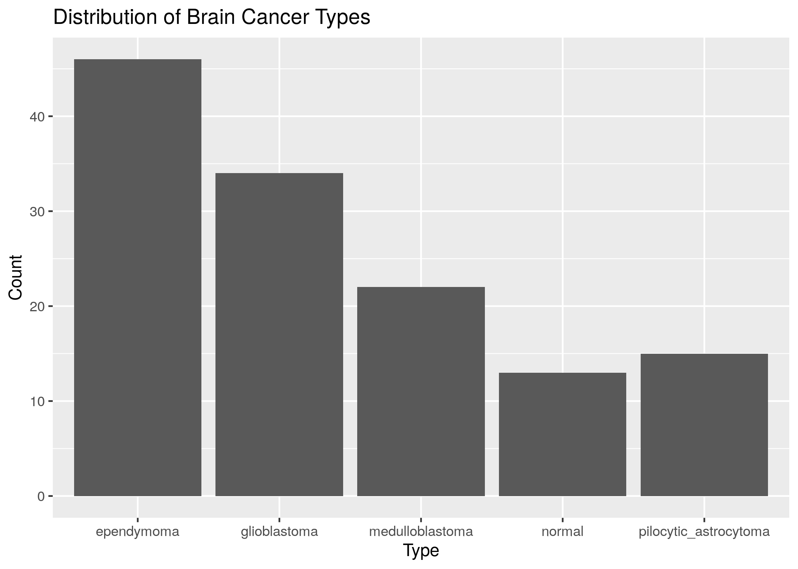

```{r setup, include=FALSE}
knitr::opts_chunk$set(echo = TRUE)
```
```{r, echo=FALSE}
library(kableExtra)
```
```{r, echo=FALSE}
if (!exists("expr", inherits=FALSE)) {
  if (file.exists("../data/processed/expr.Rda")) {
    load("../data/processed/expr.Rda")
  } else {
    expr <- read.csv("../data/raw/Brain_GSE50161.csv")
    dir.create("../data/processed", showWarnings=FALSE)
    save(expr, file="../data/processed/expr.Rda")
  }
}
```

# Introduction

As we continue to improve our understanding and progress in medicine, will are able to prolong our lifespans; however, with longer lives comes new challenges. One of those challenges is cancer, one of the leading causes of death worldwide [@Bray_Ferlay_Soerjomataram_Siegel_Torre_Jemal_2018]. Recent advances in the fields of statistics, computer science, and bioinformatics have given us new tools for tackling cancer from the molecular level. In this project, we develop a classification model for predicting the type of brain cancer from a [brain cancer gene expression dataset](https://sbcb.inf.ufrgs.br/cumida) from the Structural Bioinformatics and Computational Biology (SBCB) Lab at the Federal University of Rio Grande do Sul in Brazil[@Feltes2019]. The dataset has 130 samples with gene expression data gathered via a microarray assay, with 54676 genes assayed. The cancer types included are Ependymoma, Glioblastoma, Medulloblastoma, Pilocytic Astrocytoma, and normal (non-cancer). Table 1 is a sample from the dataset. Each row is a sample from a subject, and each column pass the second are specific genes. The numbers in the entries are how much of that gene (expressed as RNA) was found in that sample. Figure 1 shows the different brain cancer types and their representation in the dataset.

```{r, echo=FALSE}
data_table <- kbl(head(expr[,1:8]), caption="The dataset", booktabs=TRUE)
kable_styling(data_table, latex_options="HOLD_position")
```

{width=75%}

# Methods

The first step was to split the data into three different sets: training, validation, and testing. Training was used to train models, validation was used to measure the performance of models and tweak them accordingly, and testing was only used after models were fully developed to view performance on an unseen dataset to minimize bias and data leakage. This left us with 66 observations for training, 34 for validation, and 30 for testing. Because the different cancer types had different numbers of observations (as seen in Figure 1.), we had to perform a stratified split of the data. We used the R package caret [@Kuhn_2008] to perform this.

For this project, we decided to focus on logistic regression as it is a powerful model for predicting probabilities of data belonging to a particular class. Of note is the ability to use ridge and/or lasso regression for variable selection via the R package glmnet [@Friedman_Hastie_Tibshirani_2010]. This is particularly useful because gene expression data tend to have many variables, and those variables tend to be collinear to the point of super-collinearity. That is true in our case, where we have 54676 variables to predict from.

The issue with logistic regression is that it is only able to regress on a binary response variable (a 0 or a 1). In order to circumvent this to use in our case of 5 different classes, we used a one-vs-all approach where we trained 5 different models where one class is picked to be the positive class, and the rest are considered as one negative class. When a prediction is performed, each model is used to predict its respective class on the data, and the model that gives the highest probability of it being its class determines the predicted class.

For ridge and lasso regression regularization, there is a parameter $\lambda$ that is used to determine how strong should the regularization be. $\lambda$ can range from $(0,\infty)$, so in order to determine which value of $\lambda$ is best we used 10-fold cross-validation, where the training data is split up into 10 stratified subsets (folds), 9 folds are used to train the model, and the last one is used to test performance. This is performed 10 times until each fold has been used to testing, and the average deviance is used to measure the fitness of the model. After testing 100 different values for $\lambda$, the best one is chosen to be used. In addition to $\lambda$, there is a parameter $\alpha$ which is the degree of "mixing" between both ridge and lasso regression, which yields elastic net regularization.

Figure 2 shows an example of cross-validation for determining $\lambda$, where two values of $\lambda$ are shown: one that gives the minimum mean cross-validated error (which is what we used), and one which is the most regularized model that is within one standard error of the minimum. Note that figure 2 is showing the model that is regressing on the Ependymoma cancer type.

{width=60%}

There are many different metrics available to use to judge the performance of a classifier, the simplest of which is accuracy; which is simply how many correct predictions were performed out of the total. The issue with accuracy is that a model can often simply predict the most abundant class and will seem to perform well, in a case with imbalanced data (like ours), other measures may be more insightful. We opted to use the receiver operating characteristic (ROC), which is a curve that plots the true positive rate against the false positive rate. The area under the curve (AUC) gives a simple numeric metric by which to judge performance.

In addition to logistic regression, we decided to investigate the use of linear discriminant analysis and $k$-nearest neighbors as other classifiers. This was to have another benchmark to compare our logistic regression model against, as well as evaluate the feasibility of using logistic regression to select variables for use in other models.

# Results and Discussion

For our logistic regression models, we trained a total of 55 different models. 11 different values for $\alpha$ were selected to determine which is the best $\alpha$ to use, and 5 models were trained for each one of those for each different class we were to regress on. Each one of those models had its $\lambda$ determined through 10-fold cross-validation as described in the methods section. Table 2 are the collated results, where we have $\alpha$ values, the mean AUC, and the number of non-zero coefficients (genes) found under lasso regression.

```{r, echo=FALSE}
load("./figures/log_models_results.Rda")
log_models_table <- kbl(log_models_results, caption="Performance of logistic regression models", booktabs=TRUE)
kable_styling(log_models_table, latex_options="HOLD_position")
```

What we see is that more ridge regression tends to have better performing models, but the improvement is negligible when compared to the gain of reduced variables. We decided to use $\alpha=1$, basically pure lasso regression, to maximize the AUC while keeping the number of coefficients as low as possible. With $\alpha=1$ our mean AUC was about 0.98 on the validation data. We did attempt to select $\alpha=0$ for a pure ridge regression model but limited the model to the top 62 most predictive genes in an attempt to lower coefficients and make way for principal component analysis, but the AUC for that reduced ridge regression model was about 0.60, so we abandoned that path.

It's interesting that the AUC negligibly changes, but there is a massive reduction in variables the more lasso regression the model uses. One would expect a higher AUC drop-off, but what this tells us is that there are only a couple of genes in this dataset that truly drive the predictive power of the model. This is important because if this were to be developed into a medical test, a small microarray plate that only detects 100 different genes is much easier and cheaper to produce than a larger microarray plate with over 50,000 genes, and that's not even taking into consideration how much more expensive RNA-seq would be to perform in a clinical setting.

After identifying the genes from the lasso regression model, we used that to train both a linear discriminant analysis (LDA) and $k$-nearest neighbors (KNN) classifiers. LDA did not have any parameters to tune and resulted in an AUC of 0.98 on the validation data. KNN did have a value of $k$ to tune, which is the number of neighbors to consider. We tested 50 different values of $k$, from 1 to 50. The AUC for each model was calculated and the results are plotted in figure 3. The best $k$ was determined to be 1, and the AUC for that was about 0.92. That is not quite as good as either the lasso regression or LDA models above, but that is still a pretty decent performance. What is interesting, however, is how KNN performs better with extremely low values of $k$. Typically the curve you would see in KNN cross-validation is that it starts out with low performance, but as $k$ increases the performance increases until it decreases again. Really a $k$ of 1 (what we selected here) is an extremely small value, and it is rather dubious how well it is able to perform when just comparing itself to 1 neighbor.

{width=60%}

With our lasso regression and LDA models performing the best, we put them to the test on the test data where the lasso regression model got an AUC of 0.9843 and the LDA model got 0.9526. It is clear that the lasso regression model is the best on this dataset, and its confusion matrix is shown below in figure 4. In addition, the accuracy of the lasso regression model was 0.9667, which is better than the best benchmark provided by the SBCB lab where they got a performance of 0.95 accuracy with a support vector machine on 3-fold cross-validation.

{width=75%}

One of the great things about lasso regression is that the variable selection it does makes it much easier for us to visualize the data post hoc. A common way to visualize high dimensional gene expression data is heat maps, as can be seen in figure 5. There would be no feasible way for us to visualize 50,000 genes (not to mention meaningless), but 100 is doable. Each column of color represents one gene (labels are omitted for clarity), and rows are broken into separate partitions based on the cancer type or lack thereof. The colors represent $\log_2$ transformed gene counts, with red being high numbers of that gene found in the sample, and blue being low. From just visual inspection, it is clear that these genes have distinct patterns in each of these different cancer types. With this sort of analysis, we could delve further into identifying those specific genes which seem to be highly active or inactive for a particular cancer type but not the others. That could provide meaningful insight into that type of cancer.


From the heat map in figure 5, it is clear that the expression profiles for the 4 cancer types share more with each other than they do with the normal type. That intrigued us, and we decided to train a new model using the full dataset of 130 observations to classify normal against non-normal types, using lasso regression to perform variable selection. That yielded 16 genes that were predictive, which paved way for us to do further dimensionality reduction by way of principal component analysis (PCA), which is shown in figure 6.


From figure 6, we can see that there is a clear distinction between normal samples and samples with some form of brain cancer. We were able to do this with just 16 genes. If a test didn't need to be hyper-specific to determine the exact brain cancer type, but just whether a patient had brain cancer or not, we could assay only 16 genes and be able to tell with a high degree of accuracy.

# Conclusion

Without final logistic regression model using lasso regression regularization, we got a great AUC of 0.9843. This tells us that developing statistical models for predicting types of brain cancers is viable and highly accurate. With just as few as 100 genes, we can have highly performative models, reducing the cost of the microarray test needed. There are many other classification techniques out there, however. This opens the way to using lasso regression for variable selection for use in other models, as we found that it worked great in this project with the case of LDA and also with KNN rather well. Deep learning, in particular, works very well with high-dimensional data. Perhaps variable selection with a lower $\alpha$ for elastic net regularization, yielding more predictive models and variables selected could work well with deep learning.

In addition, PCA was not able to be performed at the start of this project due to the dimensionality of the data being too high compared to how many observations we have. Using lasso regression to lower the variables allowed us to explore PCA to reduce dimensionality even further. It is clear that data analysis is a complex and nuanced topic, with many tools at our disposal, sometimes this can be more of an art than a science.

# Supplemental

All the code used in this project is available at [https://github.com/0Petya/brain_cancer_expression](https://github.com/0Petya/brain_cancer_expression).

# References
